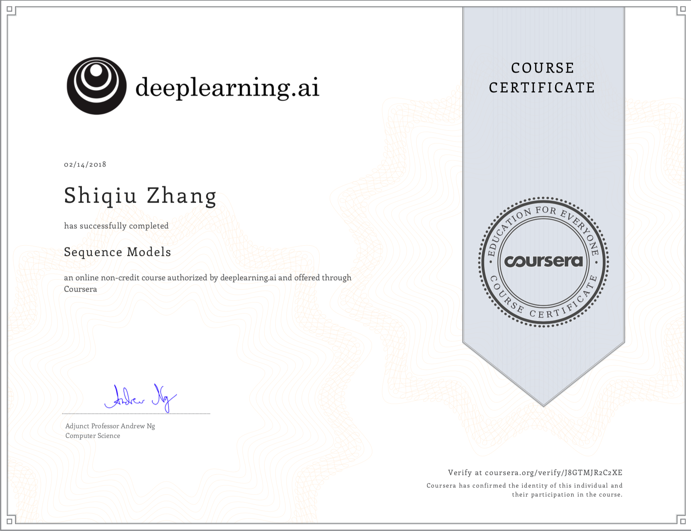
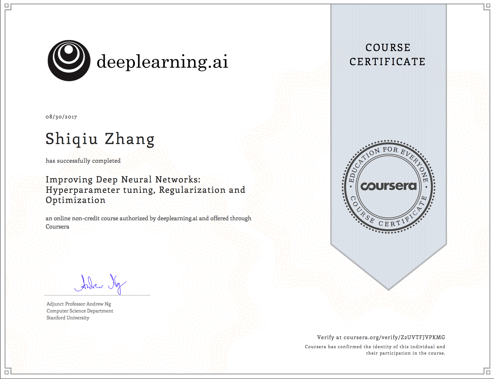
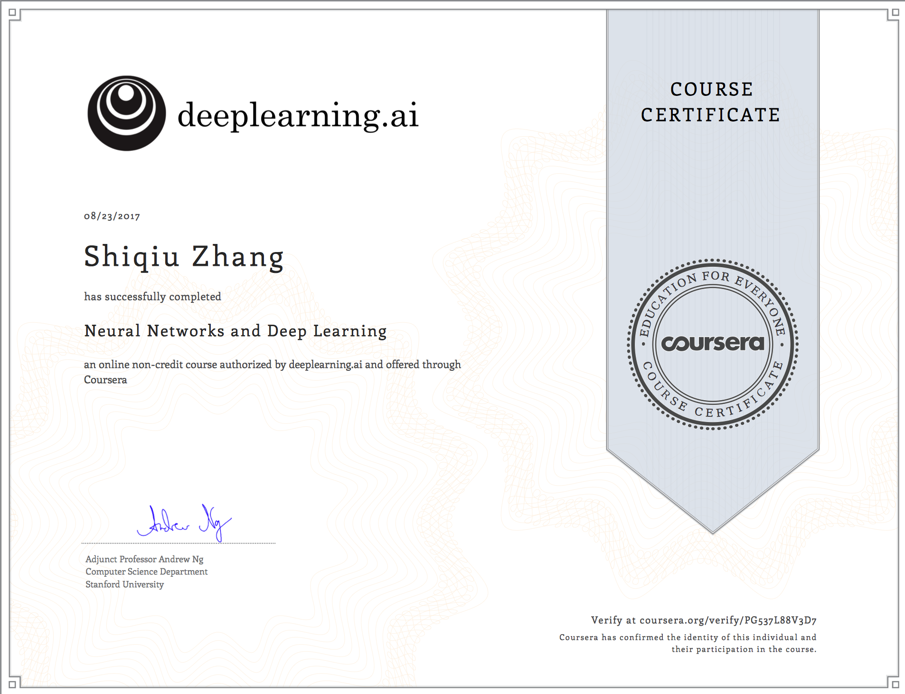
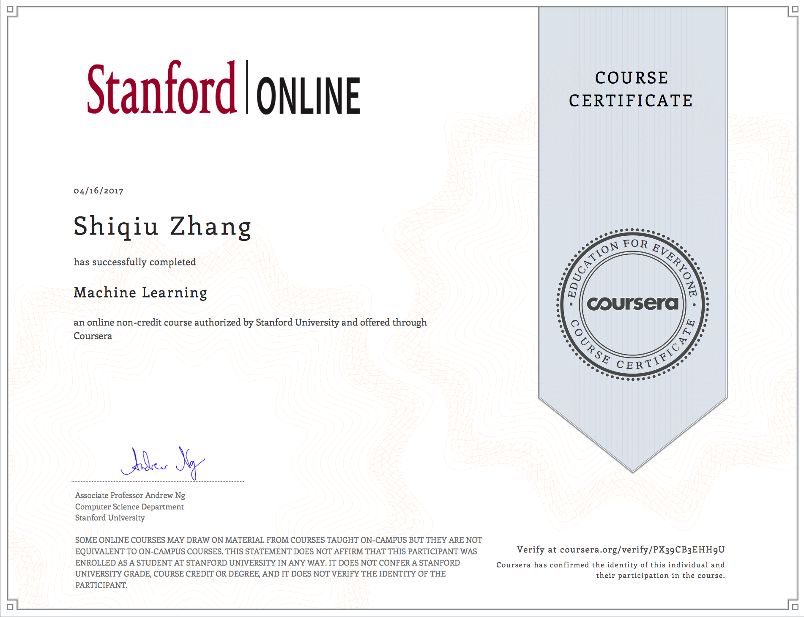

# Natural Language Processing
+ [ ] Natural Language Processing with Classification and Vector Spaces

# Deep Learning
+ [x] Neural Networks and Deep Learning
+ [x] Improving Deep Neural Networks: Hyperparameter tuning, Regularization and Optimization
+ [x] Structuring Machine Learning Projects
+ [x] Convolutional Neural Networks
+ [x] Sequence Models

# Machine Learning
+ [x] Linear Regression
+ [x] Logistic Regression
+ [x] Regularization
+ [x] Multi-class Classification
+ [x] Neural Networks
+ [x] Bias and Variance
+ [x] Support Vector Machines
+ [x] Gaussian Kernel
+ [x] K-means Clustering
+ [x] Principal Component Analysis
+ [x] Anomaly Detection
+ [x] Recommender Systems

---
*source from **Andrew Ng**'s [machine learning](https://www.coursera.org/learn/machine-learning/home/welcome) and [deep learning](https://www.coursera.org/specializations/deep-learning) course on Coursera*
