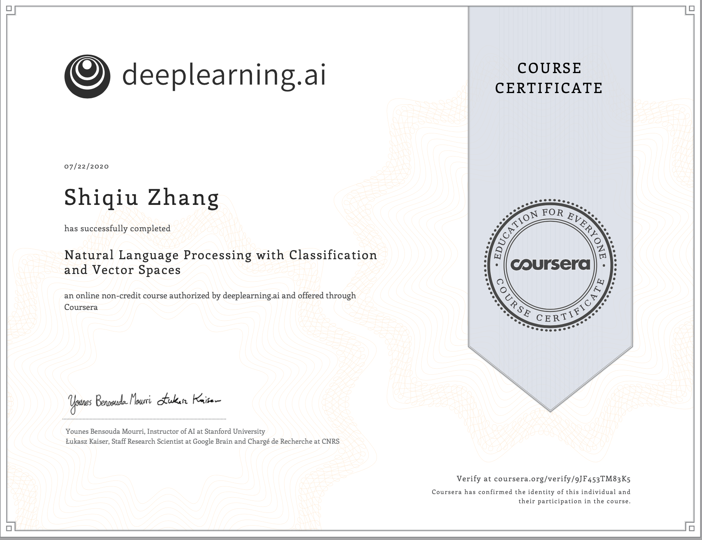
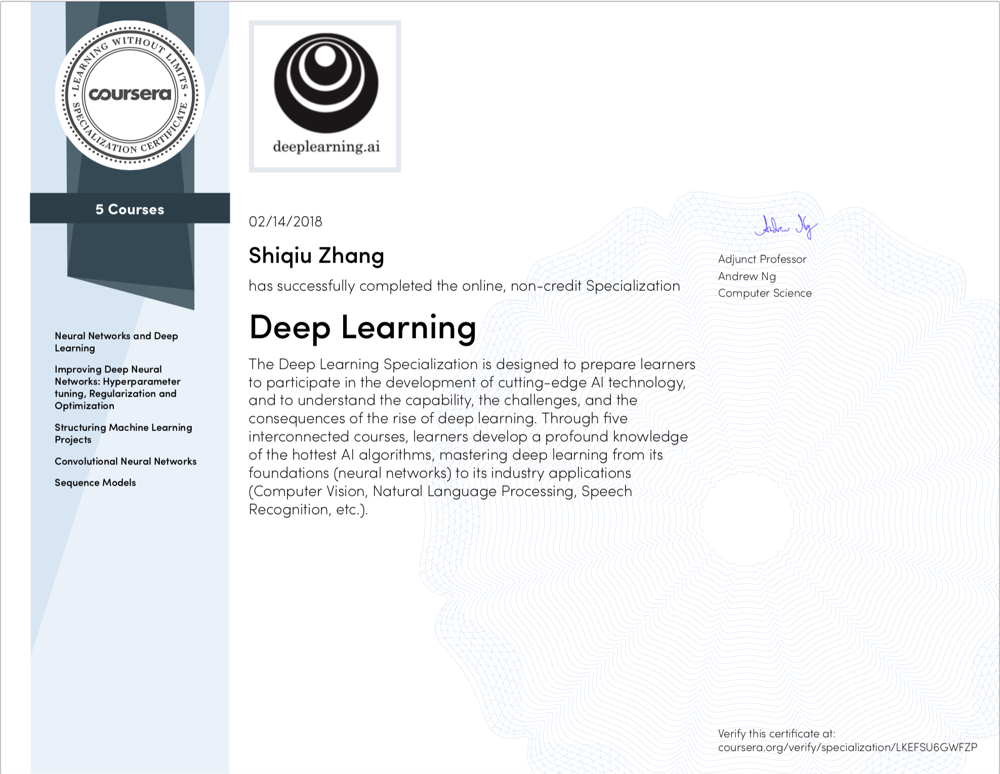

# Natural Language Processing
+ [x] Natural Language Processing with Classification and Vector Spaces

# Deep Learning

+ [x] Neural Networks and Deep Learning
+ [x] Improving Deep Neural Networks: Hyperparameter tuning, Regularization and Optimization
+ [x] Structuring Machine Learning Projects
+ [x] Convolutional Neural Networks
+ [x] Sequence Models

# Machine Learning

+ [x] Linear Regression
+ [x] Logistic Regression
+ [x] Regularization
+ [x] Multi-class Classification
+ [x] Neural Networks
+ [x] Bias and Variance
+ [x] Support Vector Machines
+ [x] Gaussian Kernel
+ [x] K-means Clustering
+ [x] Principal Component Analysis
+ [x] Anomaly Detection
+ [x] Recommender Systems
